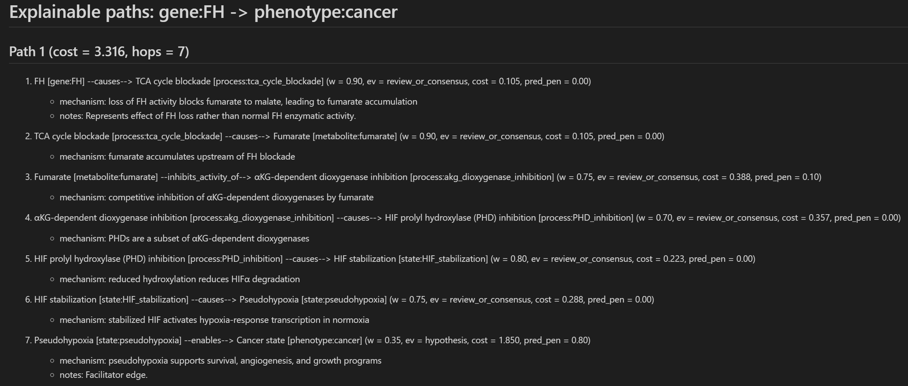

# FHRCC Mechanism Knowledge Graph ("FHRCC_mechanismKG")


## Description
Mechanism knowledge graph (KG) for fumarase-deficient renal cell carcinoma (FHRCC)/ HLRCC-associated RCC (HLRCC).

### Motivation
FH inactivation alone is insufficient for tumorigenesis in mouse models. Downstream metabolic, redox, epigenetic, and signaling adaptations appear required for cancer transformation. There do not appear to be comprehensive pathway diagrams for FHRCC tumor formation, so I created one to study. I also wanted to practice utilizing a KG, so this project takes causal assumptions and encodes them into a queryable graph.

This is a study tool and exploratory side project. Unlike some KG guides, this project implements a typed, schema-validated JSON graph to
- Encode biological entities (genes, metabolites, processes, states, phenotypes) as nodes
- Encode mechanism claims (e.g. *causes*, *inhibits*, *enables*) as edges with confidence and evidence level
- Supports path search between entities (e.g. FH loss → cancer)
- Ranks alternative mechanism explanations using weighted shortest-path logic
- Can print results to the terminal and/or export them as readable Markdown reports

**Please refer to `docs/` for important assumptions and scope of the project.**

### Architecture (High-level)
- A **node** represents a biological state or entity
    - e.g., gene, process, metabolite, phenotype
- An **edge** represents a mechanism path/explanation (with type) connecting two nodes
    - Edges are directed, typed, and follow biology
- Queries are multi-hop, ranked, path-explainable


## Quick Run
```bash
# Create and activate a virtual environment
python -m venv .venv
source .venv/bin/activate
pip install -e .

# Validate the graph JSON against the schema
python scripts/kg.py validate data/fhrcc_pathway_v1.json

# Run an explainable query:
#     source = gene:FH
#     target = phenotype:cancer
#     -k = number of alternative mechanistic paths to return
#     --max-hops = maximum number of mechanistic steps allowed in a path
#     --verbose includes mechanism/notes for each edge
python scripts/kg.py explain \
    data/fhrcc_pathway_v1.json \
    gene:FH \
    phenotype:cancer \
    -k 5 \
    --max-hops 14 \
    --verbose

# (Optional) export the same output as a Markdown report
#     --out-md = path to save the report (directories are created automatically)
python scripts/kg.py explain \
    data/fhrcc_pathway_v1.json \
    gene:FH \
    phenotype:cancer \
    -k 5 \
    --max-hops 14 \
    --out-md reports/fh-loss_to_cancer_top5.md \
    --verbose
```


## Interpreting Outputs
Example explainable query following mechanismpaths from FH loss to cancer phenotypes:



### Paths
Each path respresents a plausible mechanistic explanation (not a prediction).
- e.g. FH loss → TCA cycle blockade → fumarate accumulation → αKGDD inhibition → pseudohypoxia → cancer

Multiple paths means support for alternative biological explanations.

### Cost
Lower cost = higher confidence or more specific mechanisms.

Cost increases with
- lower confidence in edge
- vague predicates (e.g. enables, associates_with)
- speculation or hypothesis-level edges

### Hops
Number of mechanistic steps in the explanation.

### Top *k* Paths
The top-*k* lowest-cost paths. Allows user to compare between different types of paths:
- metabolic
- epigenetic
- immune-mediated
- stress-response


## Notes
### Design
- Nodes represent biological entities or states, not observations
    - Root nodes represent *biochemical insults* (primary perturbation), not phenotypes
    - For simplicity, `gene:FH` represents loss of FH function (biallelic inactivation) rather than the wild-type gene. Future versions may explicitly distinguish genes from states
- Cancer is a *terminal, probabilistic state*, not a guaranteed outcome
- Paths represent *explanations/descriptions*, not predictions
- Edge weights reflect confidence and specificity, not effect size
- Uncertainty is explicitly represented as weights and penalties

### Citations
This KG supports a `citations` field on edges, but v1 does not attempt to systematically populate citations. I keep detailed notes and citations in my study guides instead. Future versions may add citation features (e.g. attaching PMIDs/DOIs).


## References and Tools
- My study guides (all references cited there)
- Background reading on KGs/ Brainstorming ideas and design
    - https://doi.org/10.1093/bioinformatics/btaf383
    - https://doi.org/10.1093/bioinformatics/btad418
    - https://samadritaghosh.medium.com/knowledge-graphs-what-why-and-how-84f920316ca5
    - https://lopezyse.medium.com/knowledge-graphs-from-scratch-with-python-f3c2a05914cc
    - https://www.kaggle.com/code/nageshsingh/build-knowledge-graph-using-python
    - https://pmc.ncbi.nlm.nih.gov/articles/PMC7327409/
- Typed schema approach
    - Example, guide, and/or model: https://pmc.ncbi.nlm.nih.gov/articles/PMC9372416/, https://academic.oup.com/bioinformatics/article/41/7/btaf383/8177146#526378551, https://neo4j.com/blog/knowledge-graph/how-to-build-knowledge-graph/
    - Graph database/model: https://neo4j.com/developer/graph-database/
- Development
    - ChatGPT (GPT-5 to GPT-5.2): back & forth brainstorming design, code drafting, documentation
