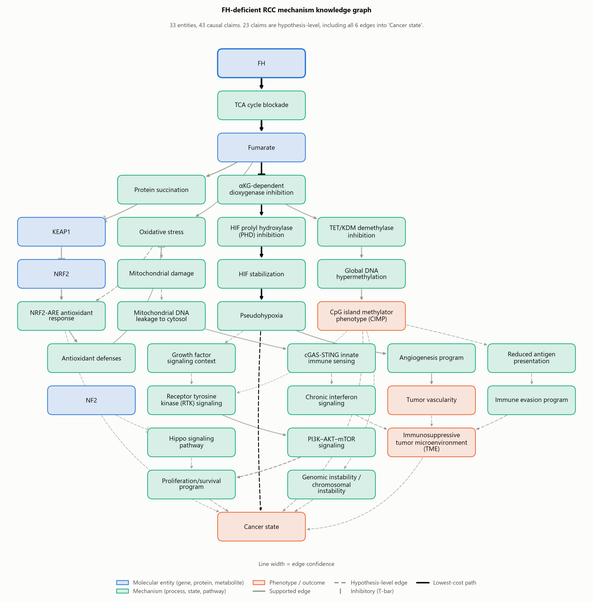
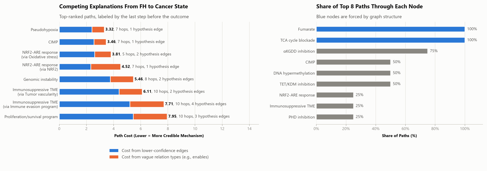
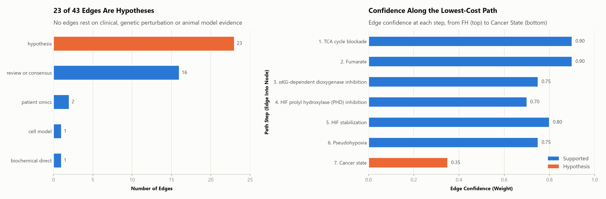

# FHRCC Mechanism Knowledge Graph

[](https://github.com/WuSelina/FHRCC-Mechanism-KnowledgeGraph/actions/workflows/ci.yml)
[](LICENSE)

A typed, schema-validated knowledge graph of mechanisms linking *FH* loss to FH-deficient renal cell carcinoma (FHRCC / HLRCC-associated RCC), with path search that ranks alternative explanations by confidence and evidence level.

**[Open the interactive explorer](https://wuselina.github.io/FHRCC-Mechanism-KnowledgeGraph/)**



## Motivation

*FH* inactivation alone is insufficient for tumorigenesis in mouse models; downstream metabolic, redox, epigenetic, and signaling adaptations appear to be required. This project encodes those causal assumptions as a queryable graph. Every edge carries a confidence weight and an evidence level, so established biochemistry and speculative links are stored, ranked, and displayed differently rather than drawn as equivalent arrows.

## Findings

The lowest-cost explanation for FH loss → cancer runs through the pseudohypoxia axis:

> FH loss → TCA cycle blockade → fumarate accumulation → αKG-dependent dioxygenase inhibition → PHD inhibition → HIF stabilization → pseudohypoxia → cancer



- The top-ranked explanations share one trunk (TCA blockade, fumarate accumulation) and diverge downstream into metabolic, epigenetic, immune-mediated, and stress-response branches.
- No route from FH loss to cancer can be built from supported edges alone; all 6 edges into the cancer node are hypothesis-level. On the best path, the final edge (pseudohypoxia → cancer, w = 0.35) accounts for 56% of the total cost.



- 23 of 43 edges (53%) are hypothesis-level. Of the 20 supported edges, 16 rest on reviews or consensus, and none on clinical, genetic-perturbation, or animal-model evidence.

Auto-generated summary: [`reports/graph_audit.md`](reports/graph_audit.md). Example query output: [`reports/fh-loss_to_cancer_top5.md`](reports/fh-loss_to_cancer_top5.md).

## Interpreting paths

Tumorigenesis does not proceed one pathway at a time. Pseudohypoxia, NRF2 activation, CIMP, and immune remodeling co-occur and influence one another, including through feedback (e.g., antioxidant defenses dampen the oxidative stress that induces them). Ranked paths are a way to compare lines of evidence, not a claim that any one mechanism acts alone. The graph does not model combined effects, timing, dose, or cell-type context; those would require a dynamic or systems-level model.

## How it works

- **Nodes** are entities or states (gene, protein, metabolite, process, state, pathway, phenotype).
- **Edges** are directed claims with a typed predicate (`causes`, `inhibits`, `enables`, etc.), a confidence weight in [0.01, 0.99], an evidence level, and an optional mechanism note.
- **Path cost** per edge is `-ln(weight) + predicate penalty`, so low-confidence edges and vague predicates (`enables`, `associates_with`) make a path more expensive. The top *k* lowest-cost paths are returned for comparison.
- **Validation** runs at load time (ID/type agreement, weight range, no self-loops or dangling edges). `kg.py lint` adds warnings for overused vague predicates, high-weight hypothesis edges, and missing mechanism notes.

## Quick start

```bash
python -m venv .venv
source .venv/bin/activate        # Windows: .venv\Scripts\activate
pip install -e ".[viz]"

python scripts/kg.py validate data/fhrcc_pathway_v1.json
python scripts/kg.py explain data/fhrcc_pathway_v1.json gene:FH phenotype:cancer -k 5 --max-hops 14 --verbose
python scripts/build_showcase.py   # regenerate figures, explorer, and audit report
```

Other commands: `summarize`, `lint`, `find <keyword>`; add `--out-md <path>` to `explain` to save a Markdown report.

## Scope and limitations

A study tool and exploratory project, not a clinical or predictive instrument. Paths are explanations, not predictions; weights encode confidence, not effect size. `gene:FH` represents biallelic FH loss rather than the wild-type gene. Coverage is incomplete and biased toward well-studied pathways (HIF, NRF2). The schema supports per-edge citations, but v1 does not populate them. See [`docs/scope_and_goals.md`](docs/scope_and_goals.md) and [`docs/biological_assumptions.md`](docs/biological_assumptions.md).

## Next steps

- Attach PMIDs/DOIs to every edge
- Sensitivity analysis of path rankings under weight perturbation
- Score co-occurring mechanism sets (subgraphs) rather than single paths
- Compare against a VHL-driven ccRCC graph to separate shared phenotypes from shared causes

## References and tools

- Knowledge graph background: [btaf383](https://doi.org/10.1093/bioinformatics/btaf383), [btad418](https://doi.org/10.1093/bioinformatics/btad418), [PMC7327409](https://pmc.ncbi.nlm.nih.gov/articles/PMC7327409/), [PMC9372416](https://pmc.ncbi.nlm.nih.gov/articles/PMC9372416/), [Neo4j guide](https://neo4j.com/blog/knowledge-graph/how-to-build-knowledge-graph/), [Ghosh](https://samadritaghosh.medium.com/knowledge-graphs-what-why-and-how-84f920316ca5), [Lopez Yse](https://lopezyse.medium.com/knowledge-graphs-from-scratch-with-python-f3c2a05914cc), [Kaggle](https://www.kaggle.com/code/nageshsingh/build-knowledge-graph-using-python)
- Interactive explorer rendered with [Cytoscape.js](https://js.cytoscape.org/)
- AI assistants (ChatGPT, Claude) helped with code drafting, figure scripting, and documentation. The biological model, curated data, and interpretation are the author's own.

## License

MIT. See [LICENSE](LICENSE).
